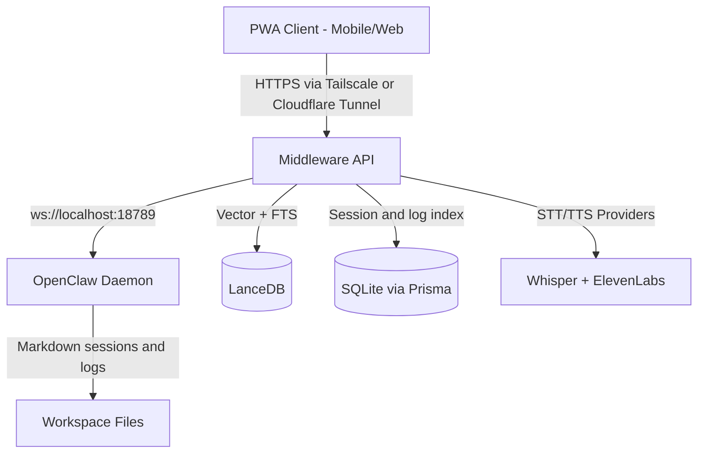

# ClawOS System Architecture (V2)

## Core Principle

Brain at home, control in your hand.

- OpenClaw is never exposed directly to the internet.
- A middleware API is the single control plane for auth, memory, and orchestration.
- Mobile and web clients connect through a secure tunnel only.

## Runtime Topology

## Component Model

### 1. Frontend (Next.js PWA)

- Chat-first UI with streaming responses
- Dashboard (Kanban, timeline, discovery feed)
- Spotlight global memory search (`Cmd+K`)
- Graph view for agent and knowledge relationships
- Voice mode with VAD and hands-free command send

### 2. Middleware (Control Plane)

- Authenticated API boundary for all client actions
- WebSocket bridge to OpenClaw local daemon
- Memory event bus (capture, embed, index, rank)
- Agent profile lifecycle (SOUL, IDENTITY, CONTEXT_BRIDGE)
- Handoff and shared-knowledge sync endpoints

### 3. Data Layer

- LanceDB as primary memory engine (vector + text search)
- SQLite as fast index for sessions, project logs, and old thread retrieval
- Namespaced retrieval by `project_id` to avoid cross-project contamination

### 4. Voice Layer

- STT: Web Speech API (fast/free path) or Whisper (high-accuracy path)
- TTS: ElevenLabs voice per agent profile
- Agent invocation by name ("Oye Lince...")

### 5. Remote Access

- Primary: Tailscale Funnel
- Alternative: Cloudflare Tunnel
- No router port-forwarding

## Memory Event Bus

1. Silent capture while agents browse/execute
2. Real-time embedding and metadata indexing
3. Proactive retrieval before each agent response
4. Context injection into active agent prompt

## Trust Boundaries

1. Untrusted client input boundary
2. Trusted middleware policy boundary
3. Local daemon boundary (private-only)
4. External provider boundary (restricted outbound calls)

## Reliability Baseline

1. Health endpoints:
   - `/health/live`
   - `/health/ready`
2. Reconnect policy:
   - exponential backoff on OpenClaw WebSocket
3. Idempotency:
   - request ids on memory writes and handoff operations
